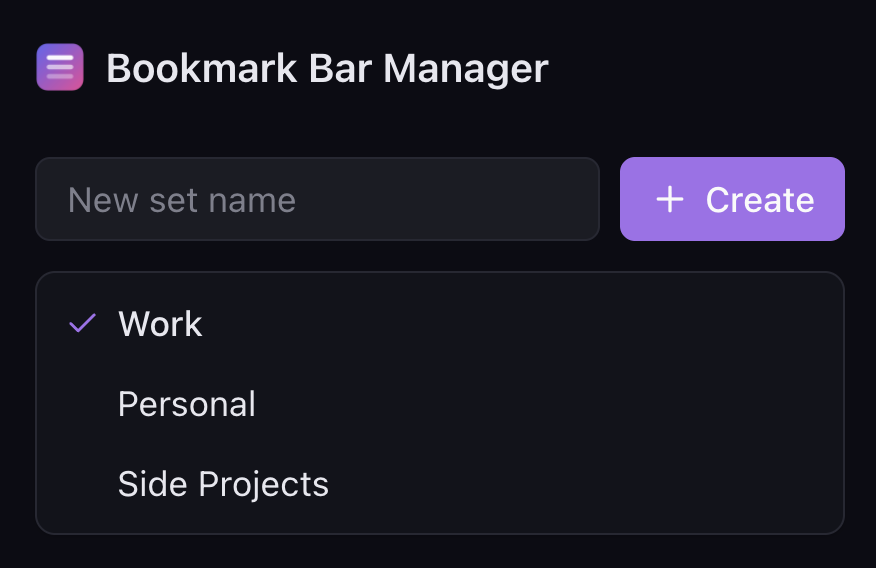

<div align="center">
  
  <h1>Bookmark Bar Manager</h1>
  <p>A Chrome extension to switch between multiple bookmark bar layouts with one click.</p>

  [](https://github.com/toniweser/chrome-bookmark-bar-manager/releases)
  [](LICENSE)
  []()
</div>

---

<!-- TODO: Replace with actual screenshot -->
<div align="center">
  
</div>

---

## What it does

Define named bookmark **sets** (e.g. Work, Personal, Side Project) and instantly swap your entire bookmark bar between them.

- Sets are stored as real Chrome bookmark folders — they survive reinstalls
- Edit sets directly in `chrome://bookmarks` if you want
- Syncs across machines via `chrome.storage.sync`
- Dark themed popup UI

## Tech Stack

| | |
|---|---|
| **Frontend** | TypeScript, React 19, Tailwind CSS v4, Lucide icons |
| **Extension** | Chrome Manifest V3, Service Worker, Bookmarks API |
| **Build** | Vite |
| **Test** | Vitest |

## Getting Started

```bash
npm install
npm run build
```

Then load in Chrome:

1. Go to `chrome://extensions`
2. Enable **Developer mode**
3. Click **Load unpacked** → select the `dist/` folder

## Development

```bash
npm run dev:preview    # UI dev server with HMR + mock data
npm run dev            # Watch mode build
npm test               # Run tests
npm run test:watch     # Tests in watch mode
```

`dev:preview` opens the popup UI at `http://localhost:5173/dev.html` with mocked Chrome APIs — no extension reload needed.

---

<div align="center">
  <sub>Built with agentic engineering using <a href="https://claude.ai/code">Claude Code</a>.</sub>
</div>
